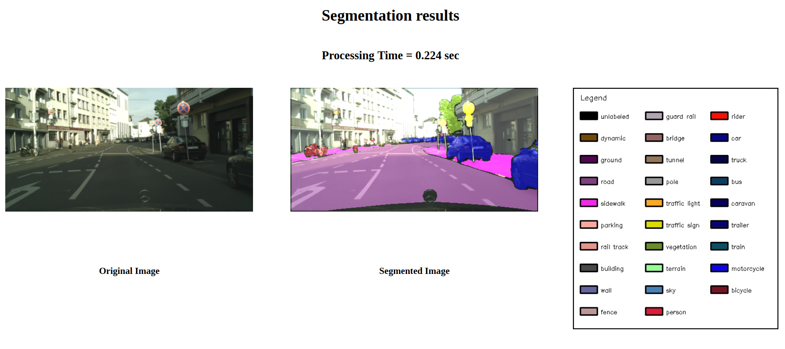
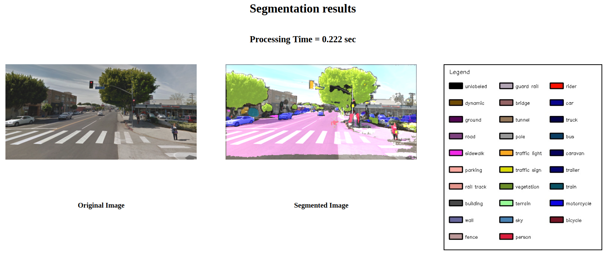

# Semantic Segmentation on CityScape Dataset
## Deep Learning for Computer Vision

### The Project
Building up on  [2 Class VGG-FCN Project](https://github.com/ruktech/Deep-Learn-Semantic-Segmentation), in this project, Fully Convolutional Network (FCN) are used to label the pixels from 29 different classes.

The CityScape dataset was used to train the network which took around 10 minutes per epoch for 150 epochs for a total of ~30 hours on an AWS p3 instance.

After training, the model was optimized for inference and a flask-based web app was built around it. During inference the model takes around 200-230 ms to run on a GTX 1050 4 GB GPU to process a single image.

Screenshots from the web app are displayed below:

---

&nbsp;&nbsp;&nbsp;&nbsp;&nbsp;&nbsp; &nbsp;&nbsp;&nbsp;&nbsp;&nbsp;&nbsp;&nbsp;&nbsp;&nbsp;&nbsp;&nbsp;&nbsp;&nbsp;&nbsp;&nbsp;&nbsp;&nbsp;&nbsp;&nbsp;&nbsp;&nbsp;&nbsp;&nbsp;&nbsp;&nbsp;&nbsp;&nbsp;&nbsp;&nbsp;&nbsp;&nbsp;&nbsp;&nbsp;&nbsp;&nbsp;&nbsp;&nbsp;&nbsp;&nbsp;&nbsp;&nbsp;&nbsp;&nbsp;&nbsp;&nbsp;&nbsp;&nbsp;&nbsp;&nbsp;&nbsp;&nbsp;  Inference on test set of CityScape dataset

---

&nbsp;&nbsp;&nbsp;&nbsp;&nbsp;&nbsp; &nbsp;&nbsp;&nbsp;&nbsp;&nbsp;&nbsp;&nbsp;&nbsp;&nbsp;&nbsp;&nbsp;&nbsp;&nbsp;&nbsp;&nbsp;&nbsp;&nbsp;&nbsp;&nbsp;&nbsp;&nbsp;&nbsp;&nbsp;&nbsp;&nbsp;&nbsp;&nbsp;&nbsp;&nbsp;&nbsp;&nbsp;&nbsp;&nbsp;&nbsp;&nbsp;&nbsp;&nbsp;&nbsp;&nbsp;&nbsp;&nbsp;&nbsp;&nbsp;&nbsp;&nbsp;&nbsp;&nbsp;&nbsp;&nbsp;&nbsp; Inference on a Google Street View image

----
